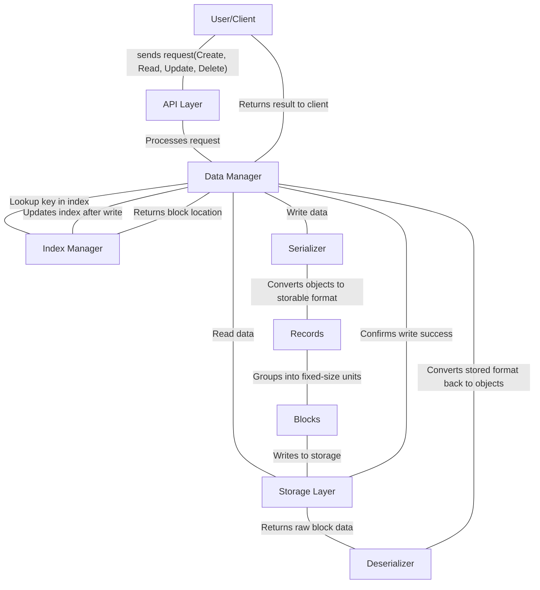

# Architecture Diagrams

## Basic Flow

1. Sends request (Create, Read, Update, Delete)
2. Processes request
3. Write data to be marshalled OR read data to be unmarshalled and sent back to data manager for client
5. Convert object into storable format
6. Groups into fixed size units
7. Writes to storage
8. storage confirms write success to data manager
9. returns result to client

regarding the index manager

>if writing
>1. after the new blocks are added to the storage layer, it will update the index(s) afterwards

>if reading
>1. the data manager consults the index manager
>2. information on the required data is returned